# ETL Homework - SF Restaurant Yelp and Health Score 

Background 

This project was an Extract, Transform and Load Project that combined Yelp Data and the SF Restaurant Health Score 

The Question "If there was a correlation between Yelp Scores and Restaurant Health Reviews" Also if clients won't mind poor health scores if the food is good enough. 

Tools 

## Step 1 - Juypter Notebook , and Yelp API Processor 

I used the YELP Api Processor in order to pull from the YELP server restaurant data specifically from SF 

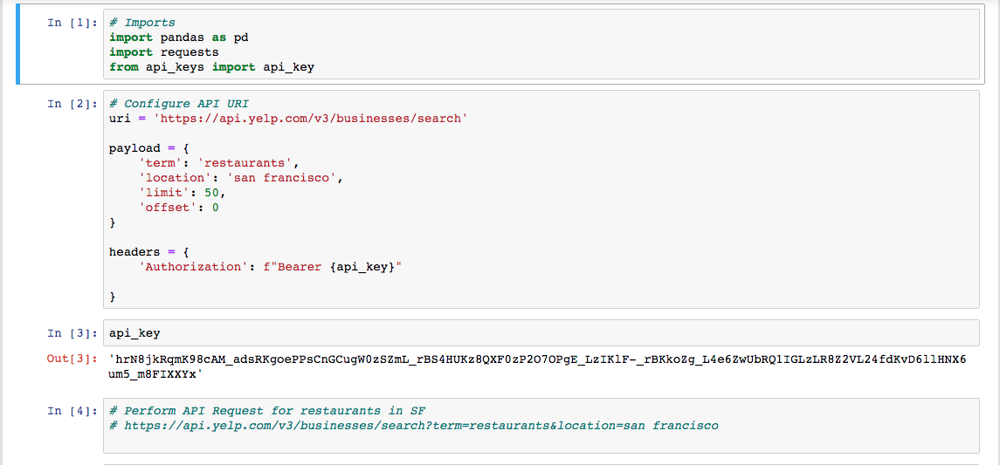

This is the setup to the YELP API Processor, this is the payload that I configured, where I would search for all restaurant posting that has a location in San Francisco 

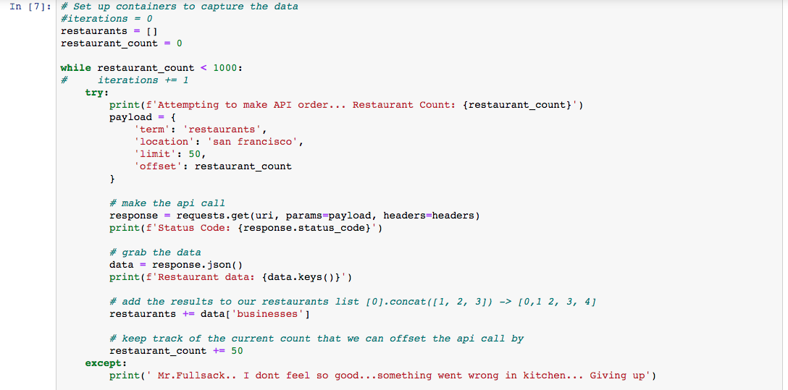

I followed the guidelines and instructions provided by yelp and pulled batches of 50 for a total of 1000 restaurants. 

I also broke down the processor into batches where if at any point there was a failure I would know at what point it failed. 

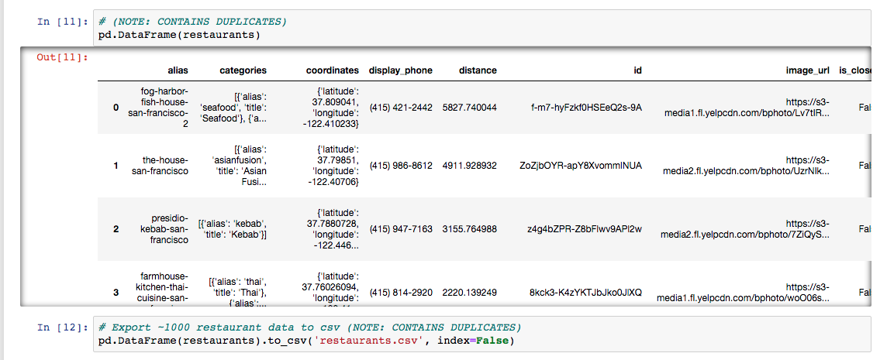

After Processing batches of 50, here is the 1000 restaurants I could pull from the YELP API that I converted from JSON to Data Frame and exported as a CSV 

## Step 2 - The Transformer -  

I used the YELP Api Processor in order to pull from the YELP server restaurant data specifically from SF 

This is the setup to the YELP API Processor, this is the payload that I configured, where I would search for all restaurant posting that has a location in San Francisco 

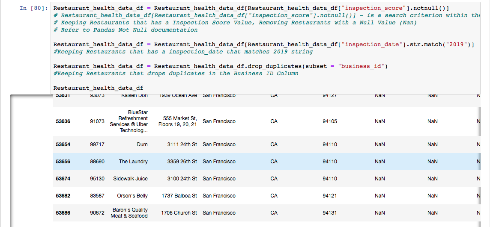

I followed the guidelines and instructions provided by yelp and pulled batches of 50 for a total of 1000 restaurants. 

I also broke down the processor into batches where if at any point there was a failure I would know at what point it failed. 

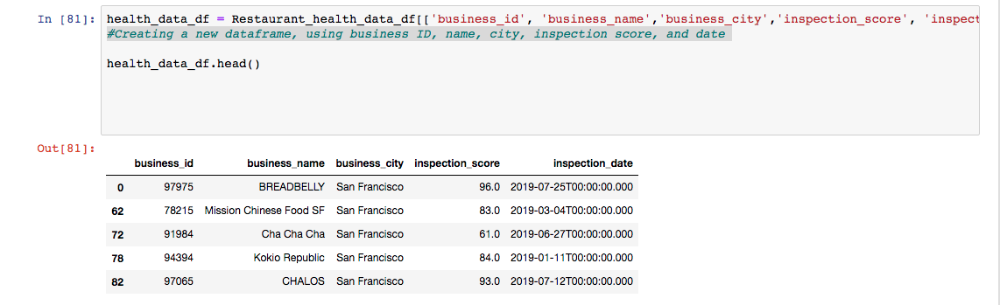

After Processing batches of 50, here is the 1000 restaurants I could pull from the YELP API that I converted from JSON to Data Frame and exported as a CSV 

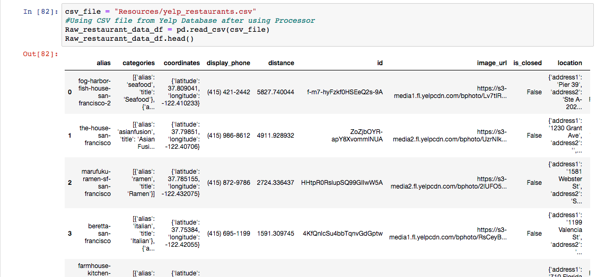

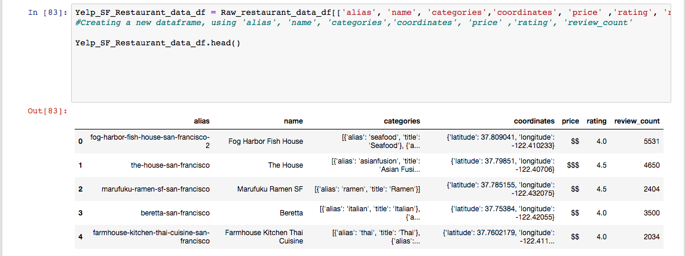

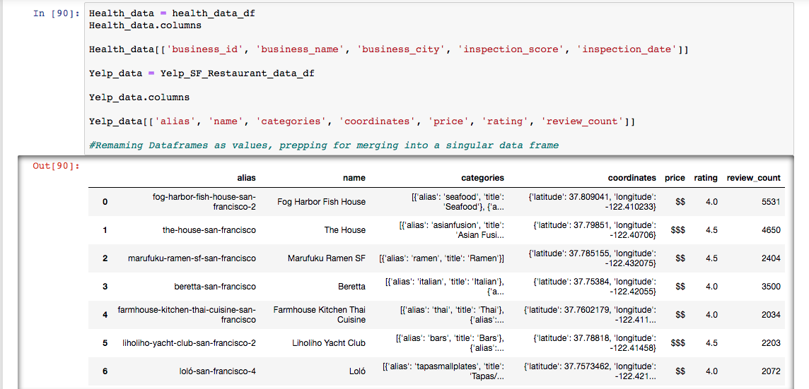

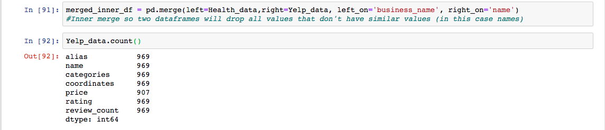

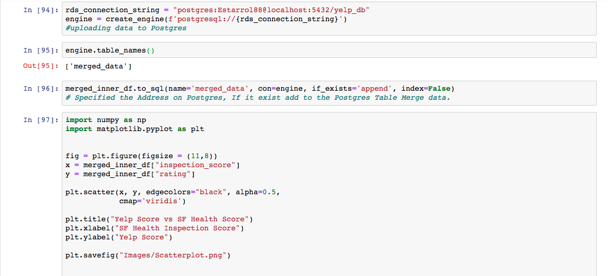

## The Transformer Graph 

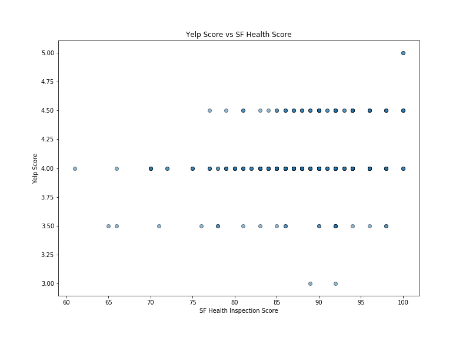

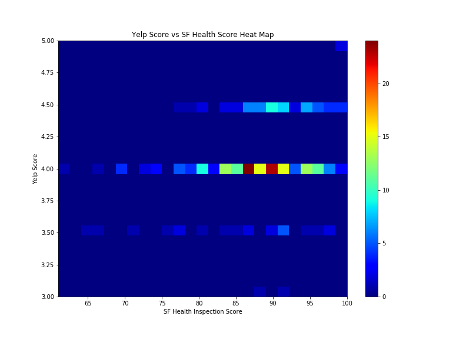

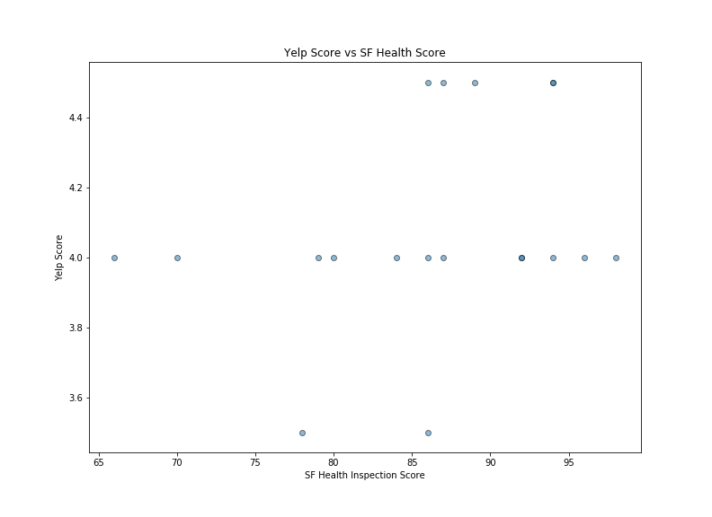

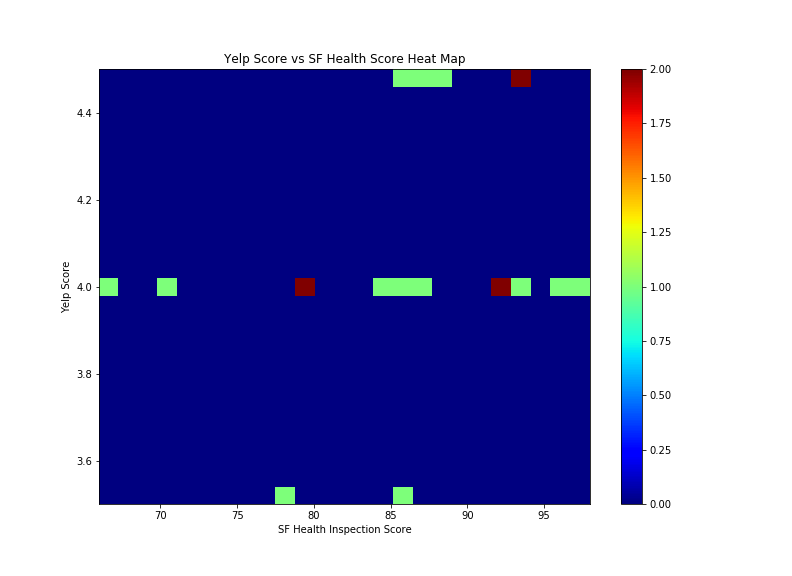

- - -

