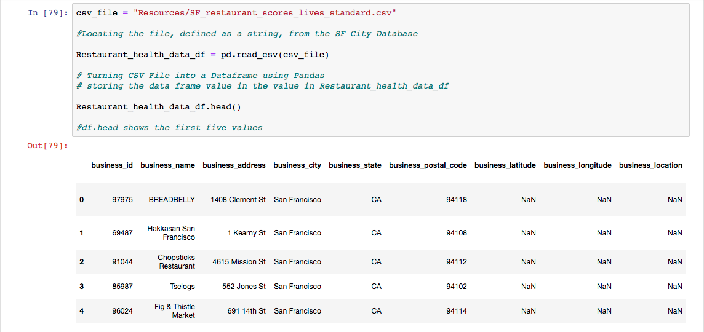

# ETL Homework - SF Restaurant Yelp and Health Score 

Background 

This project was an Extract, Transform and Load Project that combined Yelp Data and the SF Restaurant Health Score 

The Question "If there was a correlation between Yelp Scores and Restaurant Health Reviews" Also if clients won't mind poor health scores if the food is good enough. 

Tools 

## Step 1 - Juypter Notebook , and Yelp API Processor 

I used the YELP Api Processor in order to pull from the YELP server restaurant data specifically from SF 

This is the setup to the YELP API Processor, this is the payload that I configured, where I would search for all restaurant posting that has a location in San Francisco 

I followed the guidelines and instructions provided by yelp and pulled batches of 50 for a total of 1000 restaurants. 

I also broke down the processor into batches where if at any point there was a failure I would know at what point it failed. 

After Processing batches of 50, here is the 1000 restaurants I could pull from the YELP API that I converted from JSON to Data Frame and exported as a CSV 

## Step 2 - The Transformer -  

I used the YELP Api Processor in order to pull from the YELP server restaurant data specifically from SF 

This is the setup to the YELP API Processor, this is the payload that I configured, where I would search for all restaurant posting that has a location in San Francisco 

I followed the guidelines and instructions provided by yelp and pulled batches of 50 for a total of 1000 restaurants. 

I also broke down the processor into batches where if at any point there was a failure I would know at what point it failed. 

After Processing batches of 50, here is the 1000 restaurants I could pull from the YELP API that I converted from JSON to Data Frame and exported as a CSV 

Processed the Yelp Restaurant CSV into a dataframe, in order to start the transformation 

Creating a new data frame in order with columns specifics in order to later merge with the SF Health Scores, such as Restaurant name. 

This is uploading the SF Health Data and breaking it down in order to eventually merge the items with the same values in the Yelp Review Score. 

Merging the Yelp Data and the Health Data 

Using SQL and Numpy in order to plot the merged data drame. 

## The Transformer Graph 

This was the first Scatter Graph that was created plotted using the Restaurant's Yelp Score and Health score, what's shows is that a majority of Restaurants that are 4 stars range In health from 75-90

In order to better understand the density of the Restaurants, I created a "Heat Map" that shows a majority of restaurants that are highly rated are at 4 Stars, 85-90 However a Correlation score of 0.24058599175401413 means its a weak connection. 

In order to combat a myth of Asian Restaurants having poor healthscores while highly rated, we configured the project to just have Asian Restaurants, however due to the limited amount of restaurants in SF / Yelp Processors it's much smaller. Overall there isn't a true correlation 

The heat map also shows the same, with a Correlation score of 0.29407249289773696, it's a weak connection. 

## Conclusion 

A majrity of people seem to not really care about health scores when in consideration with their yelp score, however moving forward in order to expand on this would be to gather Health Scores in the greater Bay Area in order to improve the model. 

Additionally would be a better fine tuning in order to prevent "loss" of data when merging and transforming data. 

- - -

